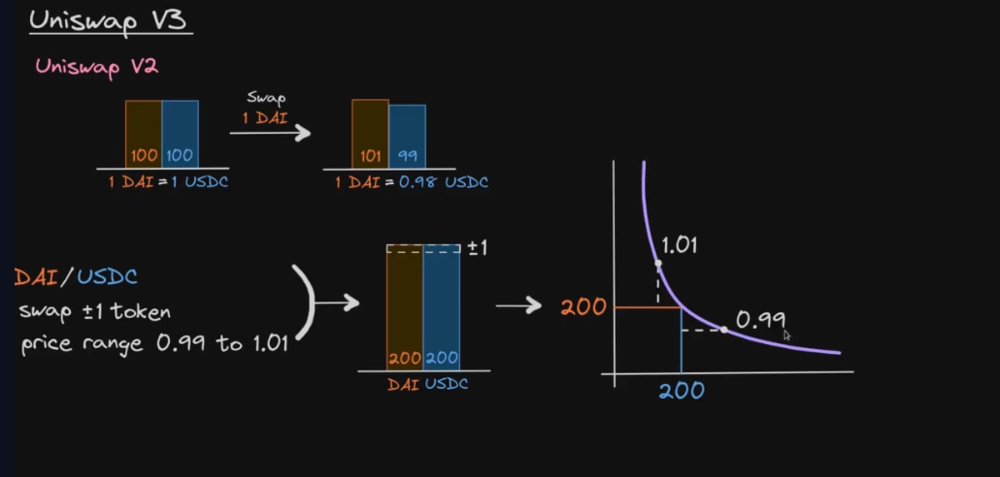

**Concentrated liquidity**

liquidity bounded within some price range

## differences in v2 and v3

**v2**
- tracks reserves X and Y -> calculate -> liquidity and price 
- passive liquidity management (ERC20)
- one fee tier (0.3%)
- TWAP (time weighted average price) - arithmetic mean

$$xy = L^2$$
$$p = y / x $$

**v3**

- tracks liquidity and price -> calculate -> reserves x and y between price ranges $P_a$ and $P_b$
- active liquidity management (ERC721)
- several fee tiers (0.01, 0.05, 0.3, 1%)
- TWAP (time weighted average price) - geometric mean

$$ x = L / \sqrt{P_a} - L / \sqrt{P_b} $$
$$ y = L \sqrt{P_b} - L \sqrt{P_a} $$

** pros and cons of v3 **

pros: higher capital efficiency for LP (liquidity pool), single sided liquidity (range limit order)

cons: active liquidity management, nonfungible tokens (ERC721) not easy to transfer

### swap algorithm 

inputs:
- zero for one (token 0 -> token 1?)
- amount specificed
- exact input = amount specified $>=0$

1. exact input = amount specified $$>=0$$ 
2. loop calculate amount in and out (while amount specified remaining $\ne$ 0 and $\sqrt{P} \ne \sqrt{P_{limit}}$) -> get next tick, calculate $\sqrt{P_{next}}$ -> calculate  $\sqrt{P}$, amount in, out, fee

3. liquidity += amount 0, $\sqrt(P)$ += amount 1, tick (swap fee)
4. update state variables liquidity, $\sqrt(P)$, tick, fee growth
5. send token out
6. if liquidity is negative(?) send token out
7. swap call back (msg.sender sends token in)
8. check token in balance

https://updraft.cyfrin.io/courses/uniswap-v3/swap/swap-algorithm

fuck im lazy